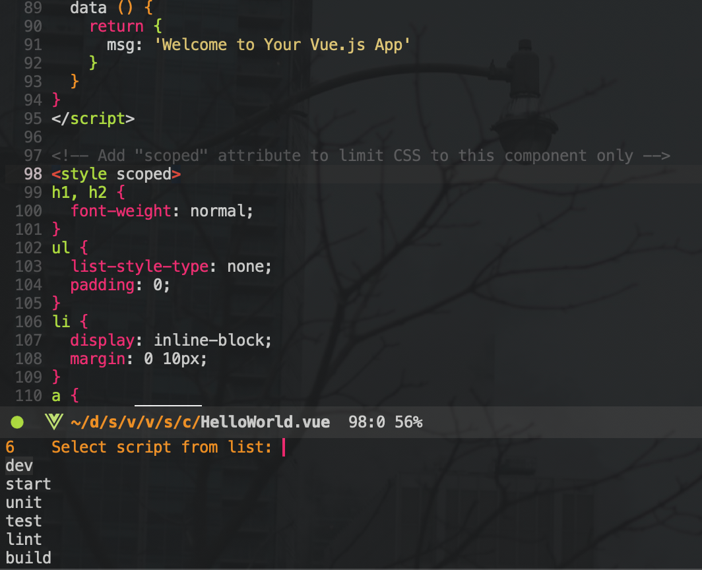
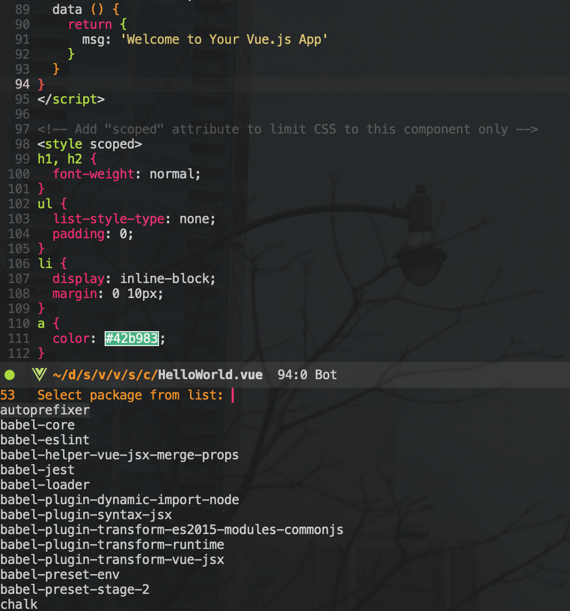

# npm.el
[](https://melpa.org/#/npm)
[](https://stable.melpa.org/#/npm)
[](https://github.com/shaneikennedy/npm.el/actions)


This is an npm client for emacs.

## Important
There is another package [npm-mode](https://github.com/mojochao/npm-mode) that serves a similar purpose to this package. npm-mode offers a way to execute npm commands quickly using key-bindings whereas this package makes use of [transient.el](https://github.com/magit/transient) to offer a more graphical user experience for interacting with npm that I find to be advantageous for exploration and in general when you aren't totally familiar with npm or your current node project. Since both packages serve a similar purpose, they both define a mode called `npm-mode` and as such there would likely be conflicts if both packages were installed. **Choose the package that best fits your desired NPM workflow**.

## Install
This package is available on MELPA

### Using `use-package`

``` emacs-lisp
(use-package npm
    :ensure t)
```

## Usage
`M-x npm`

|        |  |
:----------------------------------------------------------------------:|:-------------:
         | 


### Common workflows

If you use this package to run your dev server, then the default configuration in this package will kill the process every time you need to install/update a package or run a different script (aka not ideal). To keep your dev server (or any long running process) running while you run your other npm workflows with this package, you can set `npm-common-buffer-name-function` to `npm-common-create-unique-buffer-name` which will generate a unique buffer name for each of your workflows. You can set this directly with `setq` or through the cusomtimzation menu for `npm`.


As of right now this package only supports the `npm run, test, install, update, and publish` commands but I hope to add more functionality soon. If you have a command you would really like to see added here please open an issue!

NPM test uses the [emacs-jest](https://github.com/Emiller88/emacs-jest/tree/4c6ddd3304e199211f0fbdc8a5b83ccbfe1f7fcc) package by default.
