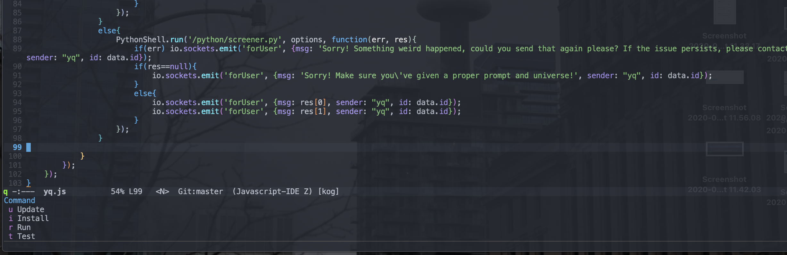
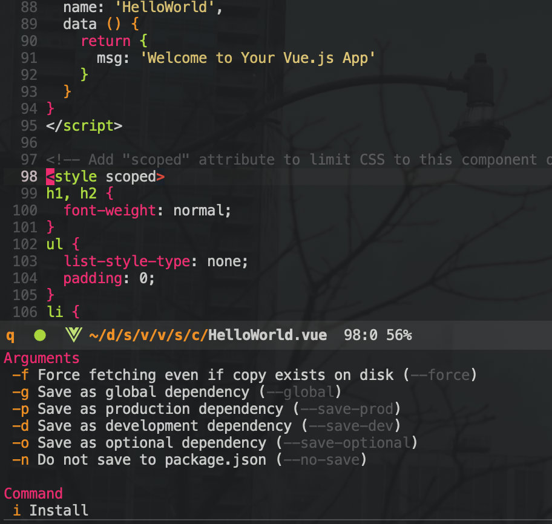

# npm.el
This is an npm client for emacs.

## Install
Clone this repo and add the following to your init.el

``` emacs-lisp
(add-to-list 'load-path "~/path/to/where/you/cloned/this/repo/")
(load "npm.el")
```

## Usage
`M-x npm`




As of right now this package only supports the `npm run, test, install, and update` commands but I hope to add more functionality soon. If you have a command you would really like to see added here please open an issue!
